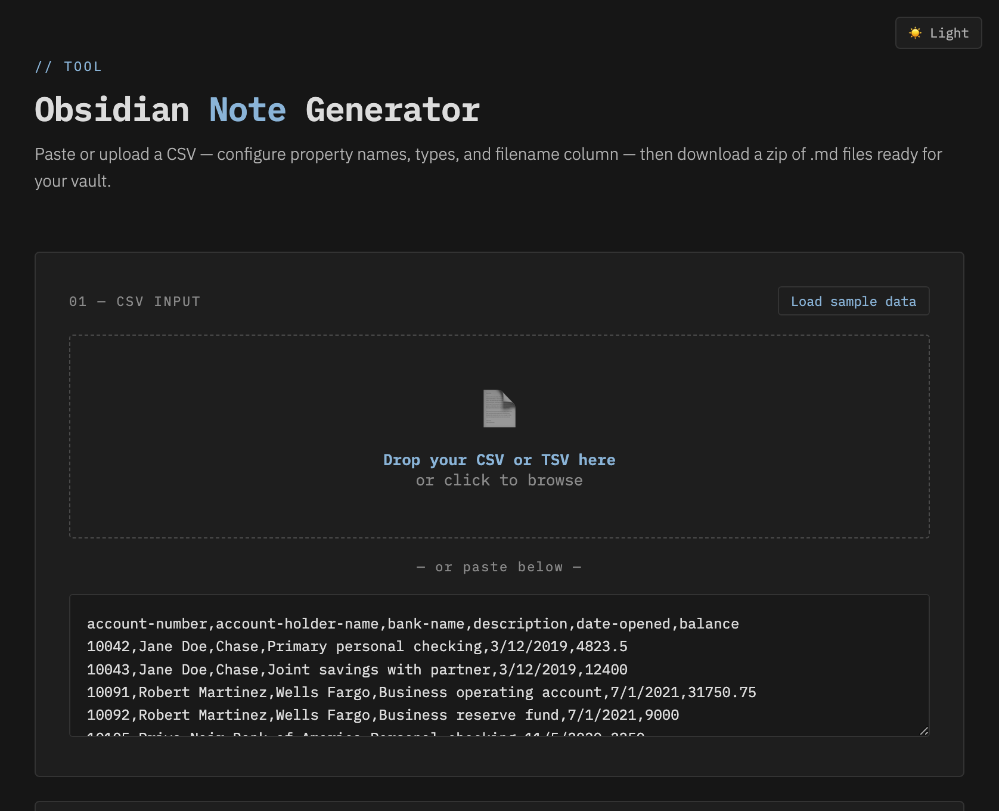
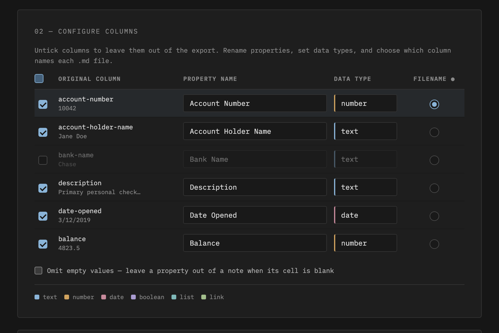
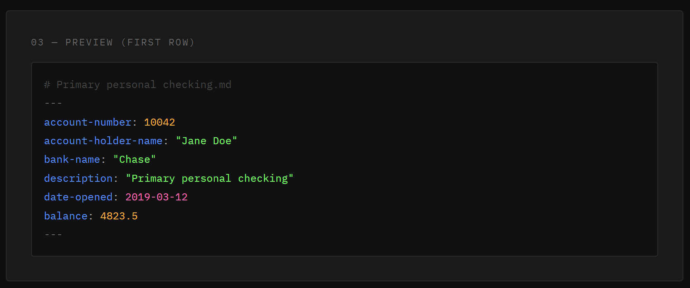
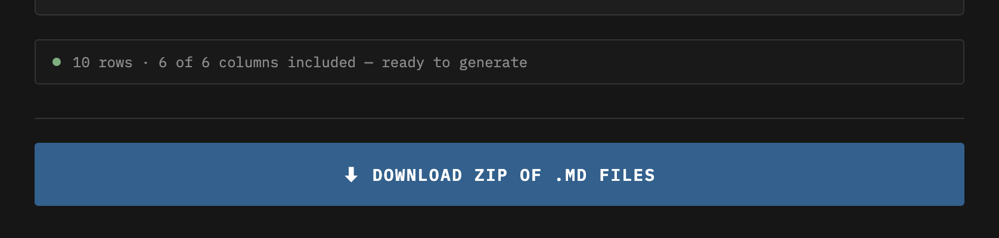

# 🗂️ Obsidian Note Generator

A lightweight, offline-capable browser tool that converts CSV or TSV spreadsheet data into Obsidian-ready `.md` files with YAML frontmatter — one file per row, downloaded as a ZIP.

No install. No account. No internet required once saved locally. Open the HTML file and go.

**🌐 Use it online:** **[grub-basket.github.io/CSV-to-Obsidian-Properties-for-Bases](https://grub-basket.github.io/CSV-to-Obsidian-Properties-for-Bases/)** — no download needed. Hat tip to [@fork-archive-hub](https://github.com/fork-archive-hub), whose fork was quietly serving this on GitHub Pages before the original repo got around to it.

> **Need to go the other way?** Try the companion tool **[Bases to CSV](https://bases-to-csv.netlify.app/)** — a web app that takes a folder of Markdown files and exports a single `.csv` you can open back in Excel. Handy as an escape hatch if Obsidian ever breaks, since an Obsidian Base is really just a YAML view/query definition — the actual data lives in each note's frontmatter, not in the Base itself — so there's no built-in way to get a plain spreadsheet back out.

---

## Screenshots

### 1. CSV Input — paste or drop your file


### 2. Column Configuration — rename properties, set types, pick the filename column


### 3. Live Preview — see the exact YAML frontmatter before generating


### 4. Output — a ZIP of .md files ready to drop into your vault


---

## Features

- **Drag-and-drop or paste** CSV/TSV directly — no file picker required
- **Auto-detects delimiter** — comma or tab, whichever your export uses
- **Pick which columns to export** — untick any column to leave it out of the generated notes; a header checkbox includes/excludes all at once
- **Per-column property naming** — headers auto-convert to readable Title Case names with spaces (e.g. `account-holder-name` → `Account Holder Name`), and you can rename any of them
- **Per-column data types** — choose from `text`, `number`, `date`, `boolean`, `list`, or `link`, each formatted correctly in YAML
- **Smart date normalization** — converts `MM/DD/YYYY`, `D-M-YYYY`, written month names, and Excel serial numbers to `YYYY-MM-DD` automatically
- **Filename column selector** — pick any column as the basis for each `.md` file's name
- **Live preview with row navigation** — color-coded YAML frontmatter updates instantly as you configure, and you can step through every row, not just the first
- **Omit empty values** — optionally leave a property out of a note when its cell is blank
- **Sample values in the column table** — each column shows an example value from your data to make type choices easy
- **Load sample data** — one click loads a built-in example CSV to try the tool
- **Duplicate filename handling** — automatically suffixes conflicting names so nothing gets overwritten
- **Quoted-field CSV support** — values containing commas are handled correctly
- **Fully offline** — works without an internet connection once `jszip.min.js` is saved locally

---

## File Structure

Keep these files in the same folder:

```
obsidian-note-generator/
├── obsidian-note-generator.html   ← open this in your browser
├── converter.js                   ← the conversion logic
├── theme-switch.js                ← dark/light theme toggle
├── styles-dark.css                ← dark theme
├── styles-light.css               ← light theme
└── jszip.min.js                   ← bundled locally for offline use
```

To go fully offline, also remove the Google Fonts `@import` line at the top of both CSS files. The fallback fonts are `monospace` and `sans-serif` (Courier New / Arial on Windows, Menlo / Helvetica on Mac).

---

## Usage

**1. Open** `obsidian-note-generator.html` in any modern browser.

**2. Load your data** — either drag your `.csv` or `.tsv` file onto the drop zone, or paste the raw CSV text directly.

**3. Configure columns** — for each column detected from your header row:
   - Tick or untick the **include** checkbox to control whether the column is exported
   - Edit the **property name** (auto-converted to Title Case from your header)
   - Set the **data type** using the dropdown
   - Click the **●** radio to choose which column names each `.md` file

**4. Check the preview** — rows render as live YAML, and the ◀ ▶ buttons step through every row so you can catch issues before generating.

**5. Click Download** — a `obsidian-notes.zip` file downloads containing one `.md` file per row.

**6. Unzip into your vault** — drop the files into the relevant folder in Obsidian.

---

## Data Types

| Type | YAML output | Notes |
|---|---|---|
| `text` | `property: "value"` | Default. Handles commas and special characters safely. |
| `number` | `property: 1234` | Unquoted. Falls back to quoted text if the value isn't numeric. |
| `date` | `property: 2024-03-15` | Normalizes multiple input formats to `YYYY-MM-DD`. |
| `boolean` | `property: true` | Recognizes `true`, `yes`, `1` as true; everything else is `false`. |
| `list` | `property:`<br>&nbsp;&nbsp;`- "value"` | Multi-value list. Cell values are split on semicolons or commas, one list item each. |
| `link` | `property: "[[value]]"` | Wraps the value in Obsidian internal link syntax. |

---

## Date Normalization

When a column is set to `date`, the tool attempts to parse and reformat to `YYYY-MM-DD`:

| Input format | Example | Output |
|---|---|---|
| Already correct | `2024-03-15` | `2024-03-15` |
| US (Excel default) | `3/15/2024` | `2024-03-15` |
| European | `15-3-2024` or `15.3.2024` | `2024-03-15` |
| Written month | `March 15, 2024` | `2024-03-15` |
| Short month | `Mar 15 2024` | `2024-03-15` |
| Excel serial | `45366` | `2024-03-15` |

If the value can't be parsed, it's passed through as-is rather than corrupted.

---

## Tips

- **Commas in values** — export from Excel normally; Excel automatically wraps fields containing commas in quotes, which the parser handles correctly. Alternatively, export as Tab Delimited (`.txt`) to avoid the issue entirely.
- **Account numbers as numbers** — set the column type to `number` so Obsidian treats them as numeric properties. Make sure the values contain no letters or symbols.
- **Internal links** — use the `link` type to wrap values in `[[...]]`. If you need multiple links in one property, use `list` type and manually format values as `[[Note Name]]` in your source data.
- **Property names** — the tool defaults to readable Title Case names with spaces (e.g. `Account Holder Name`), which display nicely in Obsidian. Note that names with spaces need bracket syntax in Obsidian Bases formulas: `note["Account Holder Name"]`. If you write a lot of Bases formulas, rename them to lowercase-with-hyphens style instead.

---

## Offline Setup

The repo already ships `jszip.min.js` locally and the HTML references it with a relative path, so offline use works out of the box: download/clone the folder, open `obsidian-note-generator.html`, done.

Optionally remove the Google Fonts `@import` line at the top of `styles-dark.css` and `styles-light.css` to drop the last external dependency (fonts fall back to your system's monospace / sans-serif).

---

## Example CSV

See [`sample-accounts.csv`](sample-accounts.csv) for a ready-to-use test file.

---

## Requirements

- Any modern browser (Chrome, Firefox, Edge, Safari)
- No server, no backend, no install

## Caveats & Disclaimers
- Not all property types are supported by this tool. For more types, review see the [Property Types documention on Obisidian's published Help Vault](https://obsidian.md/help/properties)

## Companion Tool — Bases to CSV

This tool gets data **into** Obsidian. Its companion, **[Bases to CSV](https://bases-to-csv.netlify.app/)**, gets it back **out**:

- Point it at a folder of Markdown files and it generates a single `.csv` file.
- Useful as a fallback for when you want your data back in Excel — for example if Obsidian breaks or you're migrating away.
- An Obsidian Base file is just a YAML definition of filters, formulas, and views — the actual data lives in each note's frontmatter, not in the Base. So there's otherwise no straightforward built-in way to export everything as one flat spreadsheet. This tool fills that gap.

🔗 **[bases-to-csv.netlify.app](https://bases-to-csv.netlify.app/)**

---

## Credits

- **[Claude](https://claude.ai) by Anthropic** — designed and built entirely through conversation, including the HTML, CSS, JavaScript, date parsing, and this README
- **[Google Fonts](https://fonts.google.com)** — IBM Plex Mono and IBM Plex Sans, served free for open use
- **[JSZip](https://stuk.github.io/jszip/)** by Stuart Knightley — ZIP file generation in the browser, hosted via **[Cloudflare cdnjs](https://cdnjs.com)**

### Built Circa
2026.04.03-04
